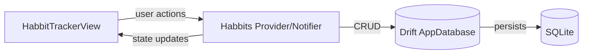
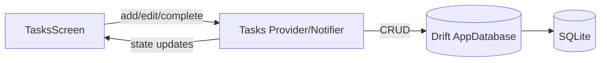
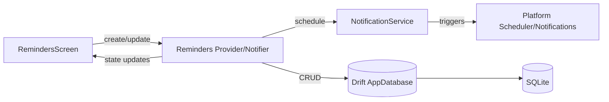
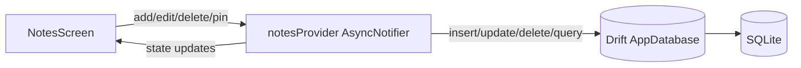
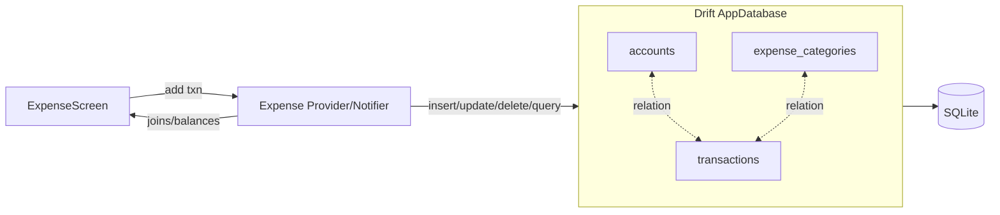

# [Routined](https://github.com/awes0m/routined)

A Flutter-based multi-utility productivity app featuring Habit Tracking, Tasks (To‑Do), Reminders, Notepad, and Expense Tracking. State management is powered by Riverpod and data is persisted locally via Drift (SQLite).

## Download- [[here](https://github.com/awes0m/routined/blob/main/routined/release/routined.apk)]

## Features

- Habit Tracker: Create and track habits with targets and progress.
- Tasks (To‑Do Lists): Manage tasks with status and organization.
- Reminders: Schedule alarms/notifications for important events.
- Notepad: Create, edit, pin, and delete notes with color tags.
- Expense Tracker: Track transactions, categories, and accounts.

---

## App Structure

```
routined/
├─ lib/
│  ├─ common/                    # Reusable UI widgets (app bar, buttons, etc.)
│  ├─ constants/                 # App-wide constants (e.g., DB constants)
│  ├─ core/                      # Colors, globals, providers, services, utils
│  │  ├─ services/               # Cross-cutting services (e.g., notifications)
│  ├─ data/
│  │  ├─ models/                 # Drift table & RowClass models (e.g., Notes)
│  │  └─ repository/             # Drift database + connection setup
│  │     ├─ app_database.dart    # Drift DB definition (tables, migrations)
│  │     ├─ app_database.g.dart  # Generated Drift code (do not edit)
│  │     └─ database_connection.dart # Lazy connection + SQLite init
│  ├─ features/
│  │  ├─ bottom_bar.dart         # Main navigation (SideBarMenu)
│  │  ├─ habbit_tracker/         # Habit Tracker UI & logic
│  │  ├─ tasks/                  # Tasks (To‑Do) screens & logic
│  │  ├─ reminders/              # Reminders screens & logic
│  │  ├─ notepad/                # Notes screens + notesProvider
│  │  ├─ expense_tracker/        # Expense tracking screens & logic
│  │  ├─ settings/               # Settings (currency, backup/restore)
│  │  └─ widgets/                # Feature-specific shared widgets
│  └─ main.dart                  # App entry point: init DB, notifications, ProviderScope
├─ android/ ios/ web/ windows/ macos/ linux/  # Platform code
└─ test/                         # Tests
```

### Architecture Overview

- UI (Flutter) renders feature screens and dispatches user intents.
- Riverpod (AsyncNotifier/StateNotifier) manages feature state and orchestrates side-effects.
- Drift (ORM) performs typed queries and migrations against SQLite.
- Services provide cross-cutting functionality (e.g., NotificationService for Reminders).

---

## Data Flow Diagrams

The following Mermaid diagrams illustrate the user and data flow for each feature.

### Habit Tracker



### Tasks (To‑Do Lists)



### Reminders



### Notepad



### Expense Tracker



---

## Backup & Restore (Import/Export)

- Export creates a timestamped backup of the SQLite database to a RoutinedBackups folder (platform-appropriate location).
- Import replaces the current database with the most recent backup. Restart app afterward.
- Available from Settings > Backup & Restore.

---

## Notes for Contributors

- Run code generation if you change Drift tables/models:
  ```bash
  flutter pub run build_runner build --delete-conflicting-outputs
  ```
- Keep providers lean; push DB logic into Drift queries and small repository helpers where needed.
